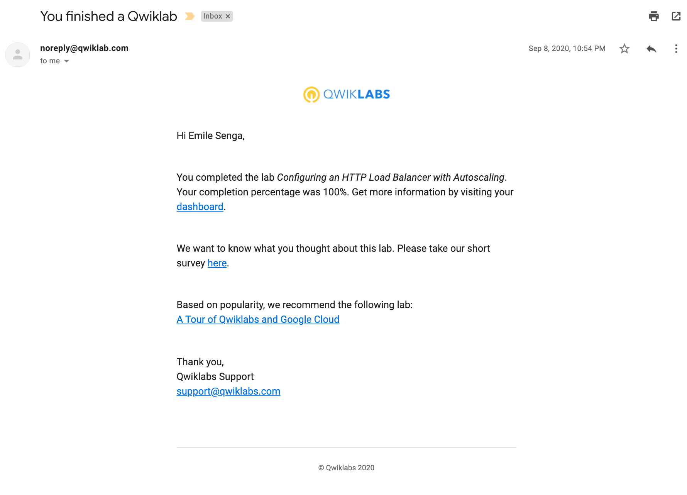
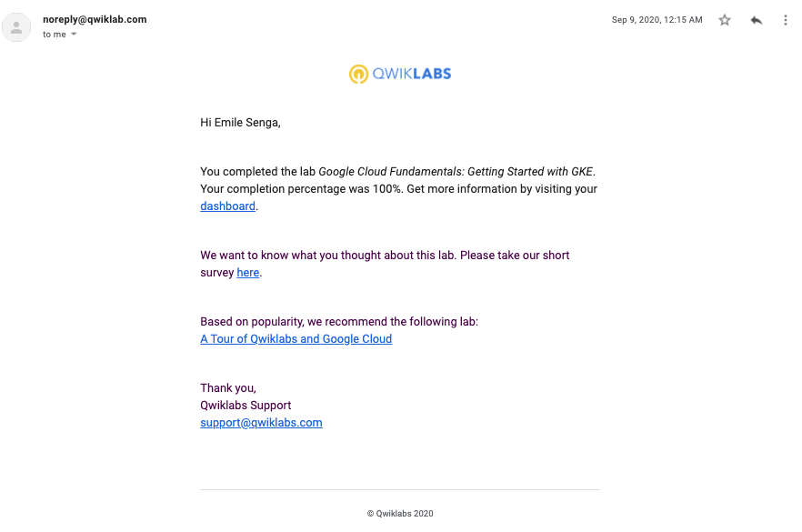
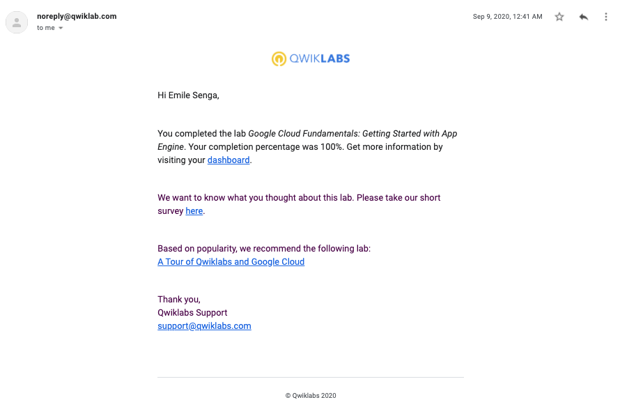

# GADS 2020

Andela Project Phase Labs

### [Lab 1 : Virtual Private Networks](translations/lab-1-Virtual_Private_Networks.md)

### [Lab 2 : Configuring an HTTP Load Balancer with AutoScaling](translations/lab-2-Configuring_an_HTTP_Load_Balancer_with_AutoScaling.md)

### [Lab 3 : Getting Started with Kuberenetes in the Cloud](translations/lab-3-Getting_Started_With_Kubernetes_In_The_Cloud.md)

### [Lab 4 : GCP Fundamentals: Getting Started with App Engine](translations/lab-4-Getting_Started_with_App_Engine.md)
